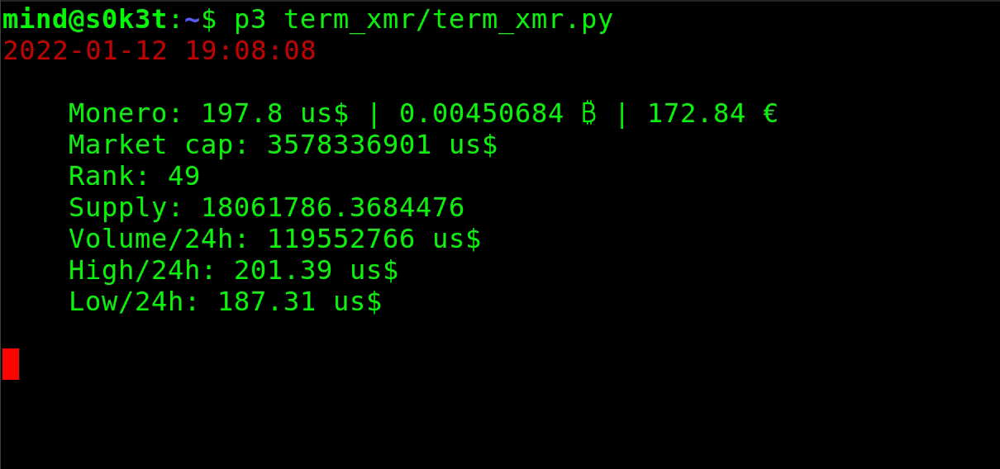

### term_xmr.py
---------------

Python3 script to display on a terminal the live price of a cryptocurrency, Monero in this case, in US Dollar, Bitcoin, Euro.

### pf_xmr.py
-------------
(21/04/22)
This script allows to check your XMR portfolio in $, ₿, €. Some major coins are added.

### Notes
---------

This script uses the CoinGecko API, for more informations: <https://github.com/man-c/pycoingecko>

#### Installation
-----------------

`pip install -r requirements.txt`

